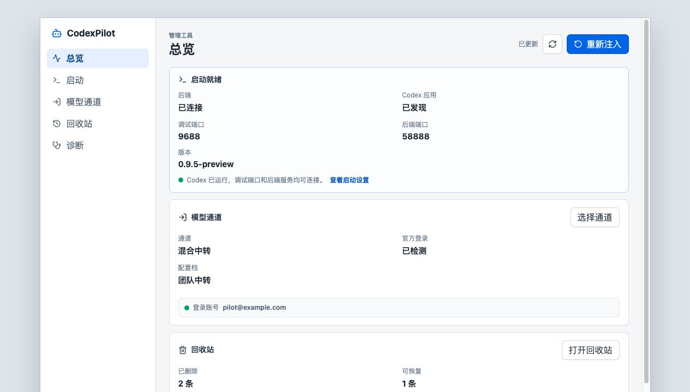

<p align="center">
  
</p>

<h1 align="center">CodexPilot</h1>

<p align="center">
  A local launcher, conversation maintenance, and model-channel manager for Codex.
</p>

<p align="center">
  <a href="README.md">简体中文</a> · <a href="README.en.md">English</a>
</p>

<p align="center">
  <a href="LICENSE"></a>
  <a href="https://github.com/hl9565/CodexPilot/releases"></a>
  <a href="https://github.com/hl9565/CodexPilot/actions/workflows/release-assets.yml"></a>
  <a href="https://tauri.app/"></a>
  <a href="Cargo.toml"></a>
</p>

CodexPilot starts and injects Codex from a local desktop manager, making session export, recycle bin cleanup, Provider ownership sync, Hybrid Relay, and diagnostics explicit and controllable. It does not modify the Codex App installation directory.

> CodexPilot is unofficial and is not affiliated with OpenAI or Codex App.



## Quick Start

1. Download an installer from [GitHub Releases](https://github.com/hl9565/CodexPilot/releases).
2. Open the CodexPilot manager.
3. Go to Launch and check the Codex path and port state.
4. Click Launch or Re-inject to open Codex through CodexPilot.
5. For custom model routing, configure Hybrid Relay in Model Channel. For historical session cleanup, use Dialog Maintenance.

Current macOS packages are not signed with an Apple Developer ID and are not notarized. If macOS cannot verify the app, read the note inside the DMG before using the bundled helper script.

## Core Features

- **Launch and injection**: start Codex from the desktop manager and inject the CodexPilot action menu.
- **Session export**: export the current conversation to Markdown for archiving, search, or sharing.
- **Dialog maintenance**: delete sessions, briefly undo deletion, inspect the recycle bin, restore records, or permanently clean backups.
- **Archived session handling**: export, delete, and batch-delete archived sessions.
- **Hybrid Relay**: keep the official Codex/ChatGPT login state while routing model requests to a custom compatible API.
- **Provider ownership sync**: preview and manually sync historical session Provider metadata instead of rewriting local history automatically.
- **Diagnostics snapshots**: collect launch, injection, page connection, route, and provider configuration logs for troubleshooting.

See [docs/features.en.md](docs/features.en.md) for the full feature guide.

## Installation

Download the package for your platform from [GitHub Releases](https://github.com/hl9565/CodexPilot/releases):

- Windows: `CodexPilot-*-windows-x64-setup.exe`
- macOS Apple Silicon: `CodexPilot-*-macos-arm64.dmg`, when provided for that release

On Windows, run the installer; it creates desktop and Start menu shortcuts.

On macOS, open the DMG and drag `CodexPilot.app` into Applications. The macOS packaging script keeps an `x86_64-apple-darwin` target for Intel Macs, but Intel builds are not currently published as verified release assets. If you use an Intel Mac, build and verify it from source.

### Run From Source

Running from source requires Rust, Node.js, and npm:

```bash
cd apps/codex-pilot-manager
npm install
npm run dev
```

Source mode is useful for local development and temporary usage. You do not need to package a DMG first.

## Local Data And Security

CodexPilot reads or writes configuration, sessions, archived sessions, state databases, and backup directories under your local `~/.codex` directory. Relay profiles are stored locally. API keys are hidden in status panels, but they are still written to local configuration files.

Use CodexPilot only on trusted devices, and avoid uploading local config, logs, screenshots, or backup directories to public repositories. When using a custom compatible API, verify the provider's privacy, billing, and data handling policies yourself.

See the [feature guide](docs/features.en.md#local-data-and-security) for the full data scope.

## Docs

- [Feature guide](docs/features.en.md): launch, model channels, dialog maintenance, Provider sync, diagnostics, and local data.
- [Architecture](docs/development/architecture.md): project structure and major modules.
- [README guidelines](docs/development/readme-guidelines.md): homepage information architecture and copy rules.
- [Release process](docs/development/release.md): packaging, publishing, and pre-release checks.
- [Roadmap](docs/development/roadmap.md): future direction.

## Support

For usage questions, feedback, and release updates, you can join the WeChat group.


This project links back to and recognizes the [LINUX DO](https://linux.do/) community. Feedback, usage notes, and improvement ideas are welcome in the community discussion thread.

## Development

```bash
cargo test
node scripts/test-renderer-inject.mjs

cd apps/codex-pilot-manager
npm install
npm run check
```

### Manager UI Preview

When changing the manager UI, you can preview it in the browser without launching the full Tauri desktop shell:

```bash
cd apps/codex-pilot-manager
npm run preview:ui
```

Then open `http://127.0.0.1:1420`. Preview mode uses local mock data for launch, model channel, dialog maintenance, and diagnostics pages. The outer window uses the real app's default `1120x760` size to make layout checks closer to the desktop app.

## License

MIT
